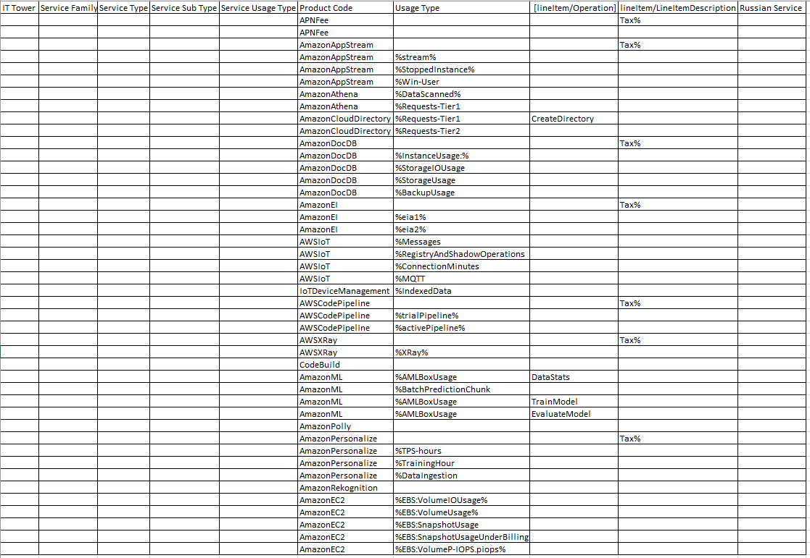

# Аналитическая лабораторная работа №1
## Цель работы:
Знакомство с облачными сервисами. Понимание уровней абстракции над инфраструктурой в облаке. Формирование понимания типов потребления сервисов в сервисной-модели. Сопоставление сервисов между разными провайдерами. Оценка возможностей миграции на отечественные сервисы.
## Дано:
1. Слепок данных биллинга от провайдера после небольшой обработки в виде SQL-параметров. Символ % в начале/конце означает, что перед/после него может стоять любой набор символов.
2. Google с документациями провайдера

|Сервис|Описание|
|------|--------|
|APNFee|Amazon Partner Network – это международная партнерская инициатива для технологических и консалтинговых компаний, которые используют Amazon Web Services для создания сервисов и решения для клиентов.|
|AmazonAppStream|Платформа, которая позволяет разработчикам просто организовать потоковую трансляцию работы приложений из облака на мобильные устройства.  <h3>Посистемы:</h3><ol><li>User Pool: Управление пулом пользователей, позволяющее определять, кто имеет доступ к стриминговым ресурсам. Это помогает в управлении аутентификацией и авторизацией пользователей.</li><li>Image Builder: Этот сервис позволяет создавать и настраивать образы для использования в качестве основы для флотов AppStream. Image Builder упрощает процесс подготовки и настройки виртуальных машин для стриминга.</li><li>Fleet: Определяет набор виртуальных машин, которые будут использоваться для стриминга приложений. Fleet позволяет масштабировать количество экземпляров в зависимости от нагрузки и требований приложений.</li></ol>|
|AmazonAthena|Инструмент, который позволяет пользователям легко запрашивать наборы данных на Amazon S3 с помощью простых команд SQL. Он предоставляет службы запросов для быстрого анализа данных.  <h3>Посистемы:</h3><ol><li>Query Execution: Позволяет отправлять SQL-запросы к данным, хранящимся в Amazon S3. Athena автоматически обнаруживает схему данных, что позволяет пользователям проводить анализ без предварительной подготовки данных.</li><li>Presto Engine: Amazon Athena использует движок Presto, который обеспечивает быстрое выполнение сложных запросов. Presto позволяет работать с данными в форматах Parquet, ORC, JSON, Avro, CSV и других.</li></ol>|
|AmazonCloudDirectory|Полностью управляемый специальный облачный каталог. Позволяет легко сохранить иерархические связи данных по множеству направлений, создавать гибкие облачные каталоги для организации иерархических связей данных по множеству направлений. <h3>Подсистемы:</h3><ol><li>Directory: Это основной компонент CloudDirectory, предоставляющий средства для создания и управления каталогами данных. В каталогах можно хранить разнообразные типы объектов и их атрибутов. </li><li> Schema: Сервис схемы позволяет определять и изменять структуру объектов в каталоге. Вы можете определить различные типы объектов, их атрибуты, а также связи между объектами.</li></ol>|
|AmazonDocDB| Управляемый проприетарный сервис баз данных NoSQL, поддерживающий структуры данных документов и имеющий некоторую совместимость с MongoDB.  <h3>Подсистемы:</h3> <ol><li> Amazon DocumentDB Clusters: Позволяют создавать и управлять кластерами базы данных DocumentDB, которые предоставляют масштабируемость и отказоустойчивость. </li><li> Instances: Предоставляют ресурсы для выполнения операций базы данных. Кластеры DocumentDB могут включать несколько экземпляров для балансировки нагрузки и обеспечения высокой доступности. </li><li> Security Groups: Управление доступом к вашей базе данных DocumentDB с использованием правил безопасности. </li><li> Snapshots: Позволяют создавать резервные копии базы данных на момент времени и восстанавливать их при необходимости.</li></ol>|
|AmazonEI|Cервис, который позволяет пользователям подключать ускорение логических выводов на базе GPU к инстансам Amazon EC2. Эта служба предназначена для того, чтобы помочь пользователям оптимизировать свои приложения машинного обучения (ML) и искусственного интеллекта (AI), предоставляя им необходимые ресурсы для эффективного выполнения моделей.|
|AWSIoT| Облачная платформа, которая работает с тысячами подключенных устройств и способна обрабатывать триллионы запросов одновременно. Для хранения коммуникационных файлов и включения функций AWS IoT Services предоставляет облачную инфраструктуру — информация хранится на серверах Amazon Web Services.  <h3>Подсистемы:</h3><ol><li>AWS IoT Core: Это основной сервис для обеспечения связности и управления устройствами IoT. Позволяет управлять миллионами подключенных устройств, обеспечивает шифрование данных и обеспечивает масштабируемость. </li><li> AWS IoT Device Management: Предоставляет возможности управления жизненным циклом устройств, включая регистрацию, конфигурацию и удаление устройств. Также поддерживает обновление встроенных программ (Firmware) на удаленных устройствах. </li><li> AWS IoT Device Defender: Сервис для обеспечения безопасности и управления угрозами для устройств IoT. Предоставляет возможности мониторинга и обнаружения аномалий в сетях устройств.</li></ol>|
|IoTDeviceManagement|Включает в себя удаленную регистрацию, настройку, подготовку, обслуживание и мониторинг подключенных устройств с централизованной платформы, к которой IT-администраторы могут получить доступ через подключение к Интернету из любого места на любом устройстве.|
|AWSCodePipeline|Это решение для непрерывной доставки, которое позволяет моделировать, визуализировать и автоматизировать этапы развертывания программного обеспечения. Различные этапы процесса выпуска программного обеспечения можно легко смоделировать и настроить.|
|AWSXRay|Сервис распределенной трассировки, который помогает анализировать и отлаживать распределенные приложения, помогает понять сложное поведение системы, выявляя и устраняя проблемы с производительностью и ошибки.|
|AWS CodeBuild|Это полностью управляемый сервис сборки в облаке. CodeBuild компилирует ваш исходный код, запускает модульные тесты и создает артефакты, готовые к развертыванию. CodeBuild устраняет необходимость в подготовке, управлении и масштабировании ваших собственных серверов сборки.|
|AmazonML|Сервис машинного обучения, который позволяет разработчикам легко использовать и интегрировать в существующие или новые продукты и решения. AmazonML API позволяет разработчикам значительно упростить добавление интеллекта в любое приложение с помощью набора сервисов, которые предлагают функции речи, языкового анализа, видения и чат-бота. Они также поддерживаются мощным сервисом шифрования, обеспечивающим хранение и безопасность данных.|
|AmazonPolly|это облачный сервис Amazon Web Services, который преобразует текст в устное аудио. Он позволяет разработчикам создавать приложения и продукты с поддержкой речи.|
|AmazonPersonalize|Это сервис машинного обучения (ML) с минимумом программирования, который может предоставлять отличительные предложения для любого приложения, работающего в инфраструктуре Amazon Web Services (AWS), с помощью вызова API. Цель Amazon Personalize – повысить вовлеченность пользователей, предлагая индивидуальные предложения.|
|AmazonRekognition|Это Amazon Web Service (AWS), предоставляющий сервисы анализа изображений и видео. Вы можете предоставить изображение или видео, и сервис обнаружит объекты, людей и сцены. Обнаруженные лица также могут быть сопоставлены с набором известных лиц. Это позволяет реализовать такие сценарии использования, как верификация пользователей, подсчет людей или общественная безопасность.|
|AmazonEC2|Это сервис, который предоставляет вычислительные мощности путем предоставления виртуальных/физических машин с заранее созданными образами операционных систем (например, Ubuntu, Debian, Windows). <h3>Подсистемы:</h3><ol><li>Amazon EC2 Container Service (ECS): Предоставляет возможность управления контейнерами Docker на экземплярах EC2.</li><li>Amazon EC2 Auto Scaling: Предоставляет возможность автоматического изменения количества экземпляров EC2 в ответ на изменение нагрузки на приложение.</li><li>Amazon Elastic Load Balancer (ELB): Обеспечивает распределение нагрузки между несколькими экземплярами EC2, обеспечивая высокую доступность и устойчивость.</li></ol>|

## Сопоставление сервисов AWS и Российской компании Yandex Cloud

APNFee - Yandex Cloud Partner Program

AmazonAppStream - None

AmazonAthena - Yandex Managed Service for MySQL

AmazonCloudDirectory - None

AmazonDocDB - Yandex Managed Service for MongoDB

AmazonEI - None

AWSIoT - Yandex IoT Core

IoTDeviceManagement - Yandex IoT Core

AWSCodePipeline - None

AWSXRay - Yandex.Metrica

AWS CodeBuild - None

AmazonML - Yandex DataSphere

AmazonPolly - Yandex SpeechKit

AmazonPersonalize - None

AmazonRekognition - Yandex Vision

AmazonEC2 -	Yandex Instance Groups

## Таблица

|Service Usage Type	| Product Code	| Usage Type	| lineItem/Operation |	lineItem/LineItemDescription |	Russian Service |
|------------------|---------------|-------------|---------------------|-------------------------------|------------------|
|Tax|	APNFee		|||	Tax%	|Yandex Cloud Partner Program|
|Cloud Deployment|	APNFee		||||Yandex Cloud Partner Program|	
|Tax|	AmazonAppStream |||	Tax%	|None|
|Streaming Desktop Application|	AmazonAppStream	| %stream%	|||None|
|Stop|	AmazonAppStream	| %StoppedInstance%	|||None|
|Windows Cooperation|	AmazonAppStream	| %Win-User	|||None|
|Query Scanninig|	AmazonAthena |	%DataScanned%	|||Yandex Managed Service for MySQL|
|Send Request|	AmazonAthena	| %Requests-Tier1	|||Yandex Managed Service for MySQL|
|Query Boundaries|	AmazonCloudDirectory |	%Requests-Tier1 |	CreateDirectory	||None|
|DB Request|	AmazonCloudDirectory |	%Requests-Tier2	|||None|
|Tax|	AmazonDocDB ||| Tax% |Yandex Managed Service for MongoDB|	
|Instance Use|	AmazonDocDB	| %InstanceUsage:%	|||Yandex Managed Service for MongoDB|
|Database Analisis|	AmazonDocDB	| %StorageIOUsage	|||Yandex Managed Service for MongoDB|
|Storage Usage|	AmazonDocDB	| %StorageUsage	|||Yandex Managed Service for MongoDB|
|DB Back up|	AmazonDocDB |	%BackupUsage	|||Yandex Managed Service for MongoDB|
|Tax|	AmazonEI ||| Tax%	|None|
|Inference Accelerator|	AmazonEI |	%eia1% |||None|
|Inference Accelerator|	AmazonEI |	%eia2% |||None|
|Send SMS|	AWSIoT |	%Messages	|||Yandex IoT Core|
|Device Status Information|	AWSIoT |	%RegistryAndShadowOperations |||Yandex IoT Core|
|Connection Time|	AWSIoT |	%ConnectionMinutes |||Yandex IoT Core|
|Connection Protocol|	AWSIoT |	%MQTT	|||Yandex IoT Core|
|Data Index|	IoTDeviceManagement	| %IndexedData	|||Yandex IoT Core|
|Tax|	AWSCodePipeline		|||	Tax%	|None|
|Trial Planning|	AWSCodePipeline	| %trialPipeline% |||None|
|Active Planning|	AWSCodePipeline |	%activePipeline% |||None|
|Tax|	AWSXRay	|||	Tax% |Yandex.Metrica|	
|Data collection|	AWSXRay	| %XRay% |||Yandex.Metrica|
|Code compitalion|	CodeBuild	||||None|
|Get stats|	AmazonML | %AMLBoxUsage	| DataStats ||Yandex DataSphere|		
|Get predictions|	AmazonML | %BatchPredictionChunk |||Yandex DataSphere|
|Build algorithm|	AmazonML | %AMLBoxUsage | TrainModel ||Yandex DataSphere|		
|Get Evalute|	AmazonML | %AMLBoxUsage	| EvaluateModel ||Yandex DataSphere|		
|Text to Speech|	AmazonPolly	||||Yandex SpeechKit|
|Tax|	AmazonPersonalize	||| Tax% |None|	
|Set Throughput|	AmazonPersonalize	| %TPS-hours |||None|
|Model Training Time|	AmazonPersonalize	| %TrainingHour	|||None|
|Get Data|	AmazonPersonalize	| %DataIngestion |||None|
|Data Indexing|	AmazonRekognition	||||Yandex Vision|
|Get Response Time|	AmazonEC2	| %EBS:VolumeIOUsage%	|||Yandex Instance Groups|
|Data Scaling|	AmazonEC2	| %EBS:VolumeUsage%	|||Yandex Instance Groups|
|Taking Snapshot|	AmazonEC2	| %EBS:SnapshotUsage |||Yandex Instance Groups|
|Organize Your AWS Bill|	AmazonEC2	| %EBS:SnapshotUsageUnderBilling |||Yandex Instance Groups|
|Get Throughput|	AmazonEC2	| %EBS:VolumeP-IOPS.piops% |||Yandex Instance Groups|

# Вывод
В ходе выполнения данной работы мы ознакомились с облачными сервисами от Amazon. Кроме того, мы сопоставили сервисы AWS и Yandex Cloud. Однако, не для всех сервисов получилось найти аналоги в Yandex Cloud. Например: AmazonAppStream, AmazonEI и AmazonPersonalize не имеют аналогов в Yandex Cloud. Это говорит, что мы не можем полностью перейти на сервисы российского аналога, поскольку не для всех сервисов есть замена.
