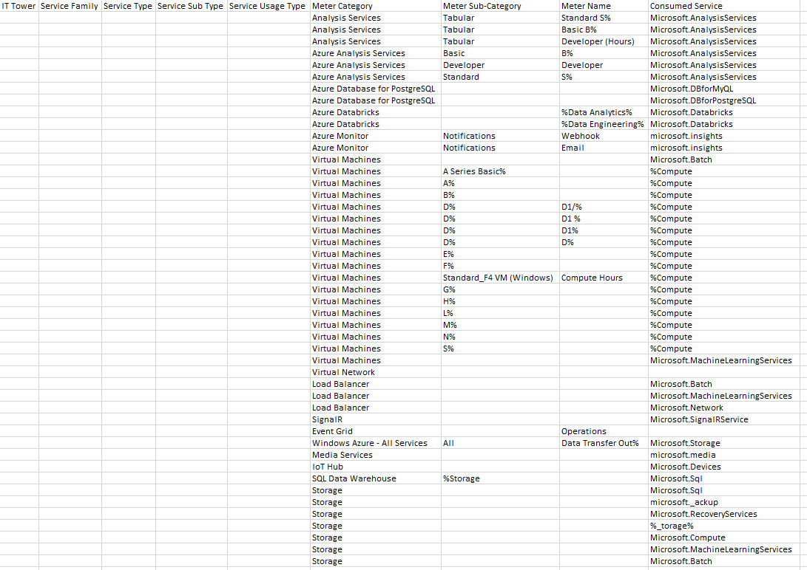

# Аналитическая лабораторная работа №2
## Цель работы:
Знакомство с облачными сервисами. Понимание уровней абстракции над инфраструктурой в облаке. Формирование понимания типов потребления сервисов в сервисной-модели. Сопоставление сервисов между разными провайдерами. Оценка возможностей миграции на отечественные сервисы.
## Дано:
1. Слепок данных биллинга от провайдера после небольшой обработки в виде SQL-параметров. Символ % в начале/конце означает, что перед/после него может стоять любой набор символов.
2. Google с документациями провайдера

|Сервис|Описание|
|------|--------|
|Azure Analysis Services|Полностью управляемая платформа как услуга (PaaS), которая предоставляет модели данных корпоративного уровня в облаке. С помощью расширенных функций комбинирования и моделирования можно объединять данные из нескольких источников данных, определять метрики и защищать данные в одной доверенной семантической табличной модели данных.|
|Azure Database for PostgreSQL|Полностью управляемая служба базы данных с минимальными требованиями к настройке базы данных. Платформа отдельного сервера рассчитана на обработку большинства функций управления базами данных, как, например, установка исправлений, резервное копирование, обеспечение высокого уровня доступности и безопасности с минимальным вмешательством пользователя дли их настройки и управления.|
|Azure Databricks|Единая, открытая платформа аналитики для создания, развертывания, совместного использования и обслуживания корпоративных данных, аналитики и решений искусственного интеллекта в масштабе. Платформа аналитики данных Databricks интегрируется с облачным хранилищем и безопасностью в облачной учетной записи, а также управляет и развертывает облачную инфраструктуру от вашего имени.|
|Azure Monitor|Это журнал платформы в Azure, который предоставляет когнитивные аналитические сведения о событиях уровня подписки. Журнал действий включает информацию, например, об изменении ресурса или запуске виртуальной машины. Вы можете просмотреть журнал действий на портале Azure или получить записи с помощью PowerShell и Azure CLI.|
|Virtual Machines|Один из нескольких типов запрашиваемых масштабируемых вычислительных ресурсов, которые предоставляет Azure. Обычно виртуальную машину выбирают, когда требуется более строгий контроль за вычислительной средой, чем в других вариантах.|
|Load Balancer|C помощью Azure Load Balancer можно масштабировать приложения и создавать службы с высоким уровнем доступности. Load Balancer поддерживает сценарии как входящих так и исходящих подключений. Load Balancer обеспечивает низкую задержку и высокую пропускную способность, а также увеличение масштаба до миллионов потоков для всех приложений, которые используют протоколы TCP и UDP.|
|SignalR|Это библиотека для разработчиков ASP.NET, которая упрощает процесс добавления веб-функций в режиме реального времени в приложения. Веб-функции в режиме реального времени — это возможность мгновенно отправлять содержимое кода сервера на подключенные клиенты по мере его доступности, а не ждать, пока клиент запросит новые данные.|
|Event Grid|Служба, которая позволяет легко создавать приложения с архитектурой на основе событий. Сначала выберите ресурс Azure, на которой вы хотите подписаться, а затем укажите обработчик событий или конечную точку веб-перехватчика для отправки события. Служба "Сетка событий" обеспечивает встроенную поддержку событий, поступающих из таких служб Azure, как хранилища BLOB-объектов и группы ресурсов. Служба "Сетка событий" также поддерживает пользовательские события с использованием соответствующих разделов.|
|Azure Media Services|Это облачная платформа, которая позволяет создавать решения для потоковой передачи видео широковещательного уровня. Она повышает доступность и уровень распространения, дает возможность анализировать содержимое и предоставляет многие другие функции. Службы мультимедиа позволяют создавать приложения для обработки данных мультимедиа высокого качества для крупных аудиторий на самых популярных современных мобильных устройствах и браузерах для всевозможных сфер деятельности.|
|IoT Hub|Это коллекция облачных служб, пограничных компонентов и пакетов SDK, управляемых корпорацией Майкрософт, которые позволяют подключать, отслеживать ресурсы Интернета вещей и управлять ими в большом масштабе. Проще говоря, решение Интернета вещей состоит из устройств Интернета вещей, которые взаимодействуют с облачными службами.|
|SQL Data Warehouse|Эта служба позволяет вам запрашивать данные, используя бессерверные ресурсы по запросу или подготовленные ресурсы в любом масштабе.|
|Storage|Это единое распределенное надежное хранилище для разных типов данных, которое позволяет каждому из пользователей сохранять петабайты данных без необходимости думать об инфраструктуре и вложениях.|

## Сопоставление сервисов Azure и Российской компании Yandex Cloud

Azure Analysis Services - None

Azure Database for PostgreSQL - Yandex Managed Service for PostgreSQL

Azure Databricks - Yandex DataSphere

Azure Monitor - Yandex Monitoring

Virtual Machines - Yandex Compute Cloud

Load Balancer - Yandex Network Load Balancer

SignalR - None

Event Grid - None

Azure Media Services - None

IoT Hub - Yandex IoT Core

SQL Data Warehouse - None

Storage - None

## Таблица

|Service Usage Type	| Meter Category	| Meter Sub-Category	| Meter Name |	Consumed Service |	Russian Service |
|------------------|---------------|-------------|---------------------|-------------------------------|------------------|
|Standart Service Level|  Analysis Services	| Tabular	| Standard S%	| Microsoft.AnalysisServices|None|
|Basic Service Level|	Analysis Services |	Tabular |	Basic B% |	Microsoft.AnalysisServices |None|
|Developer Service Level|	Analysis Services	| Tabular	| Developer (Hours) |	Microsoft.AnalysisServices |None|
|Solutions with Small Models|	Azure Analysis Services	| Basic |	B%	| Microsoft.AnalysisServices |None|
|Development and Testing|	Azure Analysis Services	| Developer	| Developer |	Microsoft.AnalysisServices |None|
|Mission-Critical Applications|	Azure Analysis Services	| Standard	| S%	| Microsoft.AnalysisServices |None|
|MySQL Using|	Azure Database for PostgreSQL	|||	Microsoft.DBforMyQL |Yandex Managed Service for PostgreSQL|
|PostreSQL Using|	Azure Database for PostgreSQL	||| Microsoft.DBforPostgreSQL |Yandex Managed Service for PostgreSQL|
|Workflow Analitics|	Azure Databricks || %Data Analytics% | Microsoft.Databricks |Yandex DataSphere|
|Processing Level Optimization|	Azure Databricks || %Data Engineering% | Microsoft.Databricks |Yandex DataSphere|
|Webhook Notify|	Azure Monitor	| Notifications	| Webhook	| microsoft.insights |Yandex Monitoring|
|Email Notify|	Azure Monitor	| Notifications	| Email	| microsoft.insights |Yandex Monitoring|
|High Peromance Computer|	Virtual Machines ||| Microsoft.Batch
|Development and Testing|	Virtual Machines | A Series Basic% || %Compute |Yandex Compute Cloud|
|Development and Testing|	Virtual Machines | A% || %Compute |Yandex Compute Cloud| 
|Economical VM|	Virtual Machines | B%	|| %Compute |Yandex Compute Cloud| 
|General Purpose Compute|	Virtual Machines | D%	| D1/% | %Compute |Yandex Compute Cloud| 
|General Purpose Compute|	Virtual Machines | D%	| D1 % | %Compute |Yandex Compute Cloud| 
|General Purpose Compute|	Virtual Machines | D%	| D1% | %Compute |Yandex Compute Cloud| 
|General Purpose Compute|	Virtual Machines | D%	| D% | %Compute |Yandex Compute Cloud| 
|Hyper-Threaded Applications|	Virtual Machines | E% || %Compute |Yandex Compute Cloud|
|Compute optimized VM|	Virtual Machines | F%	|| %Compute |Yandex Compute Cloud|
|Compute optimized VM|	Virtual Machines | Standard_F4 VM (Windows)	| Compute Hours	%Compute |Yandex Compute Cloud|
|Momory and Storage optimized VM|	Virtual Machines | G%	|| %Compute |Yandex Compute Cloud|
|High Performance Computing VM|	Virtual Machines | H%	|| %Compute |Yandex Compute Cloud|
|Storage optimized VM|	Virtual Machines | L%	|| %Compute |Yandex Compute Cloud|
|Memory Optimized VM|	Virtual Machines | M%	|| %Compute |Yandex Compute Cloud|
|GPU Enabled VM|	Virtual Machines | N%	|| %Compute |Yandex Compute Cloud|
|Series Selection|	Virtual Machines | S%	|| %Compute |Yandex Compute Cloud|
|Cloud Data|	Virtual Machines ||| Microsoft.MachineLearningServices |Yandex Compute Cloud|
|Resource Interaction|	Virtual Network	||||None|
|Distributing Compute|	Load Balancer	||| Microsoft.Batch |Yandex Network Load Balancer|
|Distributing Compute|	Load Balancer	||| Microsoft.MachineLearningServices |Yandex Network Load Balancer|
|Distributing Wen Compute|	Load Balancer	||| Microsoft.Network |Yandex Network Load Balancer|
|Adding Web Functionality to App|	SignalR	||| Microsoft.SignalRService |None|
|Operations for Events|	Event Grid || Operations ||None|
|Data Transfer Out|	Windows Azure - All Services | All | Data Transfer Out% | Microsoft.Storage |None|
|Broadcast Quality for Devices|	Media Services ||| microsoft.media |None|
|Communication between Devices|	IoT Hub ||| Microsoft.Devices |Yandex IoT Core|
|Big Data Analitics|	SQL Data Warehouse | %Storage || Microsoft.Sql |None|
|SQL Analitics|	Storage ||| Microsoft.Sql  |None|
|Data Backup|	Storage	||| microsoft._ackup |None|
|Data Recovery from Storage|	Storage	||| Microsoft.RecoveryServices |None|
|File Operation|	Storage	||| %_torage% |None|
|Storage|	Storage	||| Microsoft.Compute |None|
|Data Storage|	Storage	||| Microsoft.MachineLearningServices |None|
|High-Perfomance Computing|	Storage	||| Microsoft.Batch |None|

# Вывод

