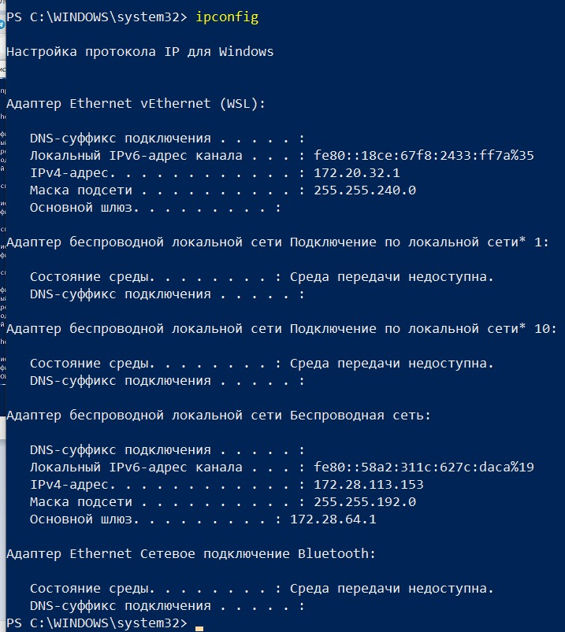
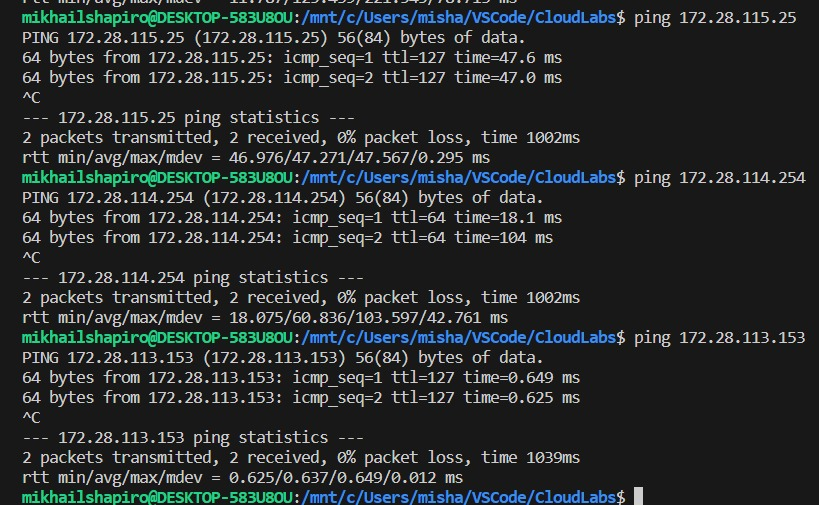
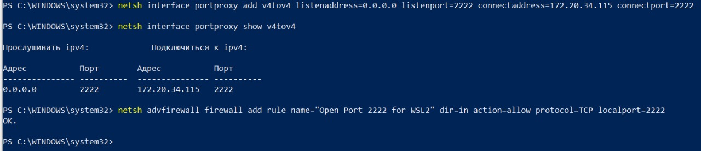
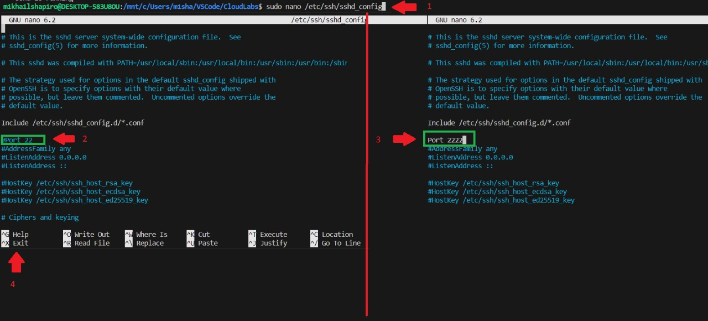
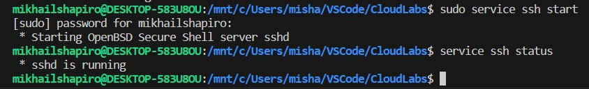
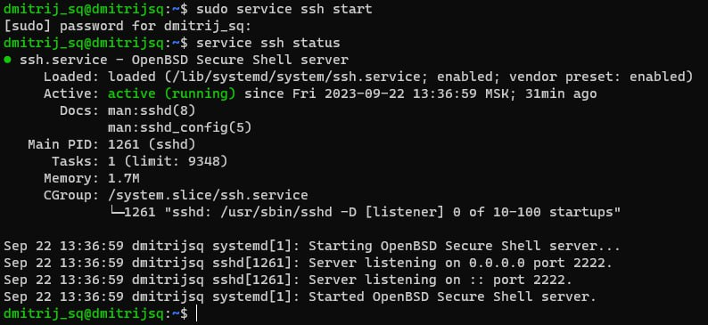
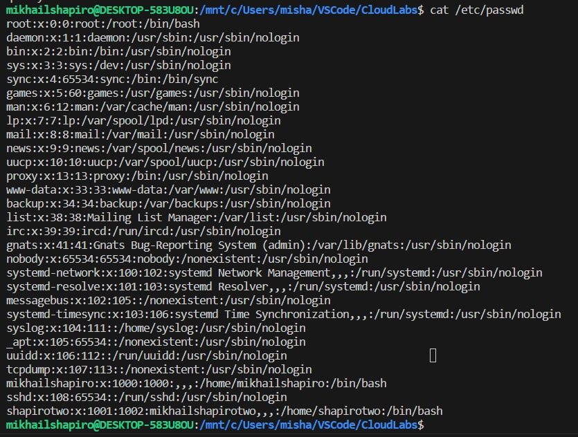
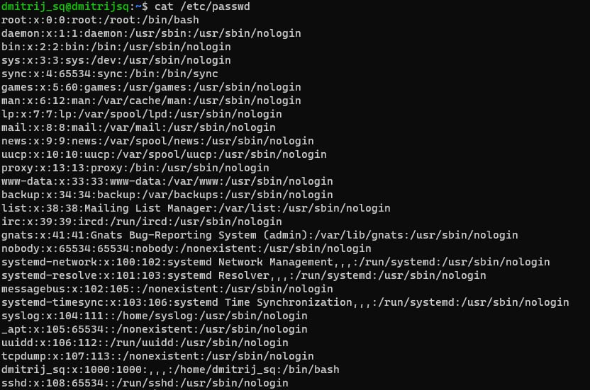

# Лабораторная работа №1

## 1. Подключаем все 3 уcтройства к общей сети

В работе использовалось два ПК с WSL и один с ОС Linux (На виртуальной машине). Все устройства были подключениы к общему Wi-Fi, 
так же на всех устройствах были разрешены все параметры общего доступа, в том числе и общий доступ к файлам для возможности передавать их между устройствами.

IP устройств были найдены с помощью команды `ipconfig`, в разделе *"Адаптер беспроводной локальной сети Беспроводная сеть"*, строка "*IPv4-адрес*" (см. рисунок 1).
В таблице ниже приведены все IP

|Устройство|IP|
|----------|--|
|PC A|172.28.114.254|
|PC B|172.28.113.153|
|PC C|172.28.115.25|

С помощью команды `ping IP` проверяем видят ли ПК IP из списка (см. рисунок 2).

Все три устройства видят друг друга, значит подключение к локальной сети было успешно выполнено.

## 2. Настройка WSL для принятия запросов на подключение к серверу.

В WSL 2 имеется виртуализированный адаптер Ethernet с собственным уникальным IP-адресом. Его можно найти с помощью команды `ifconfig` в консоле WSL. Так как запросы на подключение приходят по IP адрессу Windows, нам нужно направить их в WSL. Делается это в PowerShell (открытого от имени администратора) с помощью команды:

`netsh interface portproxy add v4tov4 listenaddress=0.0.0.0 listenport=2222 connectaddress=IP(X.X.X.X) connectport=2222`

**ВАЖНО!** В данной команде нужно вводить именно IP виртуальной машины WSL 2. Найти его можно, если зайти в WSL и прописать `ifconfig`. В графе eth0, пункт inet будет нужный IP адресс.

Таккая команда добавляет прокси-сервер портов, ожидающий передачи данных на порту узла 2222 и перенаправляющий все подключения на порт 2222 виртуальной машины WSL 2 с IP-адресом X.X.X.X Будем использовать порт 2222, так как некоторые публичные сети могут блокировать порт 22 (Стандартный порт).

С помощью команды `netsh interface portproxy show v4tov4` проверяем, что прокси-сервер был успешно добавлен (см. рисунок 3)

В завершении настраиваем правила брандмауэра с помощью команды:

`netsh advfirewall firewall add rule name=”Open Port 2222 for WSL2” dir=in action=allow protocol=TCP localport=2222`

## 3. Загрузка и настройка сервера Openssh-server

Устанавливаем openssh-server командой `sudo apt-get install openssh-server` (Если ещё не установлен). Так как мы изменили порт на 2222, нам нужно его поменять и на сервере. Так как сервер порт задаётся в конфиге, меняем конфиг с помощью команды `sudo nano /etc/ssh/sshd_config`. Меняем строку `#Port 22` на `Port 2222` (Обязательно убрать решётку) и сохраняем конфиг - Нажимаем Ctr + X Потом Y Потом Enter (см. рисунок 4).

Запускаем сервер командой `sudo service ssh start` или перезагружаем его с помощью `sudo service ssh restart`. После изменения порта обязательно нужно перезапустить сервер. Проверяем, что сервер стал активным командой `service ssh status` (см. рисунок 5-6). На некоторых устройствах выводятся сокращённые сообщения о том, что сервер активен

## 4. Подключение к серверу по SSH и копирование файлов

Для того, чтоб подключиться к серверу по SSH, нужно знать имя пользователя и IP (IP был найден в начала). Чтоб узнать имя пользователя, достаточно ввести команду `cat /etc/passwd` (см. рисунок 7-8)

